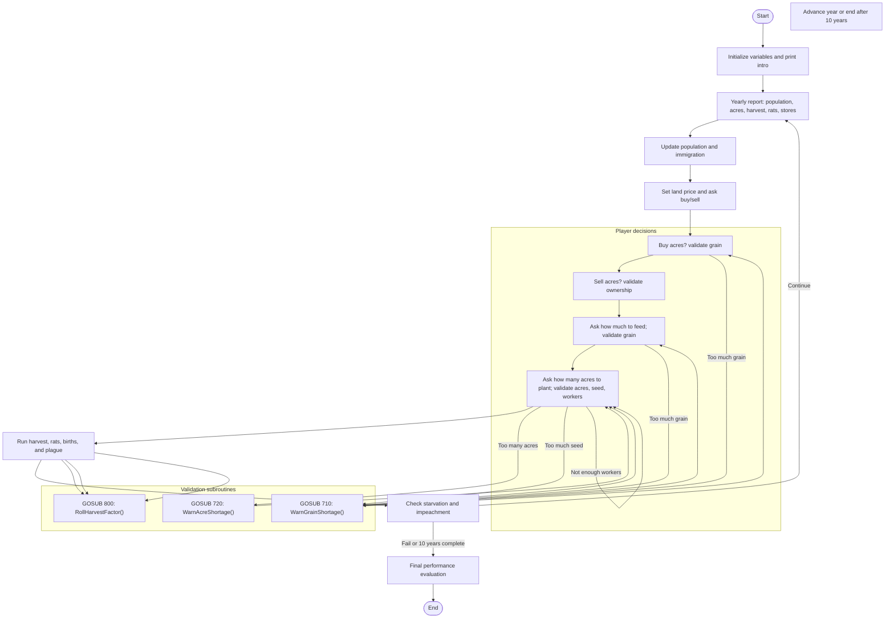
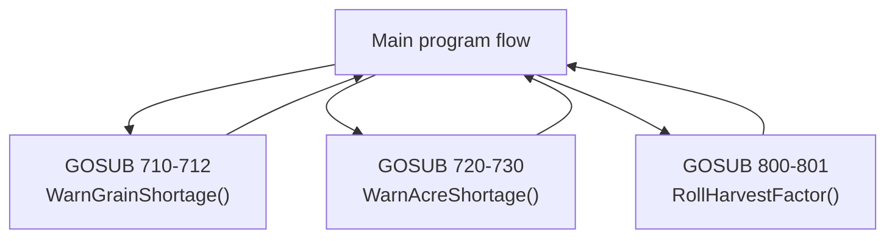

# Hammurabi BASIC Game Analysis

## Overview
This analysis covers the classic BASIC game `hmrabi.bas` from the `101_BASIC_Computer_Games` folder. The program is a year-by-year simulation of governing Sumeria, where the player buys/sells land, feeds the population, and plants crops.

### Key variables
- `Z` — current year counter
- `P` — population
- `A` — acres owned
- `S` — bushels in store
- `Y` — price per acre / harvest yield factor
- `I` — immigrants
- `Q` — temporary input/result variable
- `C` — harvest factor and later people fed
- `H` — harvest output in bushels
- `E` — bushels eaten by rats
- `D`, `D1`, `P1` — starvation tallies and averages

## Program structure
The program is organized in a linear BASIC style with a central main loop and multiple GOSUB subroutines for repeated behavior.

### Main sections
1. Initialization and introduction (lines 85-110)
2. Yearly reporting and population update (lines 210-260)
3. Land market pricing and buy/sell decisions (lines 310-350)
4. Feeding the people (lines 410-430)
5. Planting seed and validation (lines 440-510)
6. Harvest resolution, rat damage, births, and plague (lines 511-550)
7. Starvation/impeachment logic and next-year loop (lines 550-555)
8. Final evaluation after 10 years or failure (lines 860-990)

## GOSUB blocks treated as functions
The program uses GOSUB/RETURN to reuse small pieces of logic. The following blocks act like functions:

- **`710-712`** — `WarnGrainShortage()`
  - Purpose: print an error when the player tries to use more grain than is stored.
  - Called from buy/food/seed validation.
  - Returns immediately after printing.

- **`720-730`** — `WarnAcreShortage()`
  - Purpose: print an error when the player tries to use more acres than owned.
  - Called from land sell and planting validation.
  - Returns immediately after printing.

- **`800-801`** — `RollHarvestFactor()`
  - Purpose: generate a random integer from 1 to 5 used for harvest yield and population events.
  - Called repeatedly before harvest, rat damage, and baby calculation.
  - Returns with updated `C`.

### Notes on other blocks
- **`850-857`** is an invalid-action termination block, but it is reached via direct `GOTO` from invalid input rather than `GOSUB`; it is not used like a reusable function.

## Control flow diagram
The following Mermaid flowchart shows the main execution path and user decision points.

## Subroutine diagram
This Mermaid diagram maps the reusable subroutines called by the main program.

## Detailed behavior notes
- The main loop begins at line 210 and repeats until year 10 (`Z=11`) or a fatal starvation impeachment.
- Land price is randomized each year using `C = INT(10*RND(0))` then `Y = C+17`.
- Buying and selling land both reuse the same validation logic, but only the shortage messages are subroutines.
- Planting requires three constraints:
  - owned acres `D <= A`
  - available seed `INT(D/2) < S`
  - enough workers `D < 10*P`
- Harvest yield is `H = D * Y`; rat damage depends on a random factor and current stores.
- Population change is determined by how many bushels are fed and whether plague strikes.
- Starvation above 45% of the population immediately ends the game via impeachment.
- Final performance is judged by average starvation percentage and ending acres per person.

## Conclusion
The program is a compact year-loop simulation with three clear GOSUB subroutines that function as reusable behaviors:
- grain shortage warning,
- acre shortage warning,
- random harvest factor generation.

The rest of the code is a classic structured BASIC flow using line-numbered sections and `GOTO` for branching.
