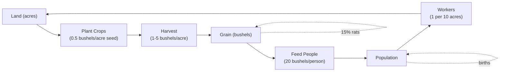

# Hammurabi — Game Economy Architecture

## Executive Summary
This document defines the exact economic formulas, random event mechanics, and state transitions from the original BASIC `hmrabi.bas` game. Every engine in the TypeScript port must replicate these formulas precisely to preserve the original game's economic balance. For any given sequence of random numbers and player decisions, the TypeScript port must produce identical results to the original.

---

## 1. Initial State

| Variable | Value | Meaning |
|----------|-------|---------|
| `Z` | 0 | Year counter (0-indexed, displayed as 1-10) |
| `P` | 95 | Initial population |
| `S` | 2800 | Initial grain in store (bushels) |
| `H` | 3000 | Initial total resource pool (used to derive A) |
| `E` | 100 | Initial rat damage placeholder (H - S) |
| `Y` | 3 | Initial yield factor |
| `A` | 1000 | Initial acres (H / Y = 3000 / 3) |
| `I` | 5 | Initial immigrants |
| `Q` | 1 | Initial plague flag (triggers plague in Year 1) |
| `D1` | 0 | Cumulative deaths across all years |
| `P1` | 0 | Running average starvation percentage |
| `D` | 0 | Deaths this year (reset each year) |

**Starting acres per person:** `A / P = 1000 / 95 ≈ 10.5` (game reports "10 acres per person")

---

## 2. Year-by-Year Processing Order

Each year follows this exact sequence. The TypeScript `YearController` must execute these steps in order.

### Step 1: Year Increment and Report (lines 210-218)
```
D = 0                          // Reset deaths for this year
Z = Z + 1                      // Increment year counter
Print: "In year Z, D people starved, I came to the city."
P = P + I                      // Add immigrants to population
```

### Step 2: Plague Check (lines 227-229)
```
IF Q > 0 THEN
    P = INT(P / 2)             // Half the population dies
    Print: "A horrible plague struck! Half the people died."
END IF
```

**Plague probability:** 80% (see Section 4 for derivation)

### Step 3: Status Report (lines 230-260)
```
Print: "Population is now P"
Print: "The city now owns A acres."
Print: "You harvested B bushels per acre."   // B is previous year's yield
Print: "Rats ate E bushels."
Print: "You now have S bushels in store."
```

### Step 4: End-of-Term Check (line 270)
```
IF Z = 11 THEN GOTO 860    // Skip to final evaluation after year 10
```

### Step 5: Land Market Pricing (lines 310-312)
```
C = INT(10 * RND(0))       // Random integer 0-9
Y = C + 17                 // Land price: 17-26 bushels/acre
Print: "Land is trading at Y bushels per acre."
```

### Step 6: Buy Acres (lines 320-334)
```
Input Q (acres to buy)
IF Q < 0 THEN GOTO 850     // Invalid input, game over
IF Y * Q > S THEN
    GOSUB 710              // Grain shortage warning, re-prompt
ELSE
    IF Q > 0 THEN
        A = A + Q          // Add acres
        S = S - Y * Q      // Deduct grain cost
        C = 0              // Reset C
    END IF
END IF
```

### Step 7: Sell Acres (lines 340-350)
```
Input Q (acres to sell)
IF Q < 0 THEN GOTO 850     // Invalid input, game over
IF Q >= A THEN
    GOSUB 720              // Acre shortage warning, re-prompt
ELSE
    A = A - Q              // Remove acres
    S = S + Y * Q          // Add grain proceeds
    C = 0                  // Reset C
END IF
```

### Step 8: Feed People (lines 410-430)
```
Input Q (bushels to feed)
IF Q < 0 THEN GOTO 850     // Invalid input, game over
IF Q > S THEN
    GOSUB 710              // Grain shortage warning, re-prompt
ELSE
    S = S - Q              // Deduct grain
    C = 1                  // Reset C (indicates no plague flag this year)
END IF
```

### Step 9: Plant Acres (lines 440-510)
```
Input D (acres to plant)
IF D = 0 THEN GOTO 511     // Skip planting, go to harvest
IF D < 0 THEN GOTO 850     // Invalid input, game over

// Constraint 1: Own enough land
IF D > A THEN
    GOSUB 720              // Acre shortage warning, re-prompt

// Constraint 2: Enough grain for seed (with desperation clause)
IF INT(D / 2) >= S THEN
    IF S >= D1 * 2 THEN
        GOSUB 710          // Grain shortage warning, re-prompt
    END IF
    // ELSE: S < D1*2, desperation planting allowed, proceed
END IF

// Constraint 3: Enough workers (1 person per 10 acres)
IF D >= 10 * P THEN
    Print: "But you have only P people to tend the fields."
    GOTO 440               // Re-prompt for planting
END IF

// All constraints passed
S = S - INT(D / 2)         // Deduct seed grain (half of planting acres)
```

### Step 10: Harvest (lines 511-530)
```
GOSUB 800                  // C = INT(RND(0) * 5) + 1  (yield factor 1-5)
Y = C                      // Harvest yield per acre
H = D * Y                  // Total harvest bushels
E = 0                      // Reset rat damage

GOSUB 800                  // C = INT(RND(0) * 5) + 1  (rat factor 1-5)
IF C IS EVEN THEN          // INT(C/2) <> C/2 is FALSE when C is even
    E = INT(S / C)         // Rat damage: S/2 if C=2, S/4 if C=4
END IF

S = S - E + H              // Update stores: subtract rats, add harvest
```

### Step 11: Births / Immigration (line 533)
```
I = INT(C * (20 * A + S) / P / 100 + 1)
```
Where C is the harvest yield factor from Step 10.

### Step 12: People Fed (line 540)
```
C = INT(Q / 20)            // Each person needs 20 bushels
```
Where Q is the bushels fed in Step 8.

### Step 13: Plague Flag (line 542)
```
Q = INT(10 * (2 * RND(0) - 0.3))
```
This value is checked at the START of the NEXT year (Step 2).

### Step 14: Starvation Check (lines 550-555)
```
IF P < C THEN GOTO 210     // Safety valve: fed > population, skip to next year

D = P - C                  // Deaths this year = population - fed
IF D > 0.45 * P THEN
    GOTO 560               // Impeachment: starved > 45% of population
END IF

P1 = ((Z - 1) * P1 + D * 100 / P) / Z   // Running average starvation %
P = C                      // New population = fed people
D1 = D1 + D                // Cumulative deaths
GOTO 215                   // Next year
```

### Step 15: Impeachment (lines 560-567)
```
Print: "You starved P people in one year!!!"
Print: "You have been impeached and thrown out of office."
Print: "You have been declared 'NATIONAL FINK'!!"
GOTO 990                   // Game over
```

### Step 16: Final Evaluation (lines 860-990)
```
Print: "In your 10-year term, P1% of the population starved per year."
Print: "A total of D1 people died."
L = A / P                  // Ending acres per person
Print: "You started with 10 acres per person and ended with L."

// Rating thresholds (checked in order)
IF P1 > 33 OR L < 7 THEN
    GOTO 565               // Terrible
ELSE IF P1 > 10 OR L < 9 THEN
    GOTO 940               // Poor
ELSE IF P1 > 3 OR L < 10 THEN
    GOTO 960               // Average
ELSE
    GOTO 900               // Fantastic
END IF
```

---

## 3. Economic Formulas

### 3.1 Land Price
```
price_per_acre = 17 + floor(10 * random())
```
- Range: 17-26 bushels/acre
- Distribution: Uniform (each value equally likely)
- Expected value: 21.5 bushels/acre
- Used for BOTH buying and selling (no spread)

### 3.2 Harvest Yield
```
yield_per_acre = 1 + floor(5 * random())
```
- Range: 1-5 bushels/acre
- Distribution: Uniform (each value equally likely)
- Expected value: 3.0 bushels/acre
- Separate random roll for each year

### 3.3 Seed Cost
```
seed_grain = floor(planting_acres / 2)
```
- Each acre planted costs 0.5 bushels as seed
- Fractional bushels are truncated

### 3.4 Net Grain per Planted Acre
```
net_per_acre = yield_per_acre - 0.5
```
- Expected net: 3.0 - 0.5 = 2.5 bushels/acre
- After rat damage (see 3.6): ~2.1 bushels/acre expected

### 3.5 Rat Damage
```
rat_factor = 1 + floor(5 * random())   // Separate roll from harvest
IF rat_factor IS EVEN THEN
    rat_damage = floor(grain_stores / rat_factor)
ELSE
    rat_damage = 0
END IF
```
- Rat factor: 1-5 (uniform)
- Rats strike when factor is even (2 or 4): 40% chance
- If factor = 2: rats eat 50% of grain stores
- If factor = 4: rats eat 25% of grain stores
- Expected rat damage: 0.4 × (0.5 × 0.5 + 0.5 × 0.25) × S = 0.15 × S
- **Rats eat approximately 15% of grain stores on average**

### 3.6 Population Consumption
```
people_fed = floor(bushels_fed / 20)
```
- Each person requires 20 bushels per year to not starve
- **You need approximately 10 acres per person to feed them** (20 bushels ÷ 2.1 net bushels/acre ≈ 9.5 acres)

### 3.7 Births / Immigration
```
new_arrivals = floor(harvest_yield × (20 × acres + grain_stores) / (population × 100) + 1)
```
- Uses harvest yield factor C from Step 10
- Rewards good harvests, large land holdings, and grain stores
- Non-linear: doubling population halves the growth
- Minimum: 1 (the +1 ensures at least 1 arrival even in worst case)

**Example calculations:**
| Scenario | C | A | S | P | New Arrivals |
|----------|---|---|---|---|-------------|
| Poor | 1 | 100 | 500 | 50 | 1 |
| Average | 3 | 300 | 2800 | 50 | 6 |
| Great | 5 | 500 | 5000 | 50 | 16 |

### 3.8 Plague Probability
```
plague_flag = floor(10 × (2 × random() - 0.3))
```
- Range: -3 to 16 (20 possible values, uniform)
- Plague strikes when `plague_flag > 0`: 16/20 = **80% chance**
- No plague: 4/20 = **20% chance**
- **Note:** The original comment says "15% chance of plague" but the actual formula gives 80%. This is a documented discrepancy in the original code.
- Year 1 always has plague (initialization Q=1)

### 3.9 Starvation
```
deaths_this_year = population - people_fed
```
- If `deaths > 0.45 × population`: immediate impeachment
- Player must feed at least 55% of population to survive

### 3.10 Running Average Starvation
```
P1 = ((Z - 1) × P1 + deaths_this_year × 100 / population) / Z
```
- Standard running average of starvation percentage
- Each year's starvation % gets equal weight
- At year Z: weighted average of all Z years

### 3.11 Final Evaluation Thresholds

| Rating | Avg Starvation % | Acres/Person |
|--------|------------------|--------------|
| **Fantastic** | ≤ 3% | ≥ 10 |
| **Good** | ≤ 10% | ≥ 9 |
| **Average** | ≤ 33% | ≥ 7 |
| **Terrible** | > 33% | < 7 |

Both conditions must be met for a positive rating. Either condition failing drops the rating to the next level or worse.

---

## 4. Random Number Mapping

The original BASIC uses `RND(0)` which generates a uniform random number in [0, 1). The TypeScript port must use `Math.random()` which produces the same distribution.

| Original Formula | TypeScript Equivalent | Range | Distribution |
|-----------------|----------------------|-------|--------------|
| `INT(10*RND(0))` | `Math.floor(Math.random() * 10)` | 0-9 | Uniform |
| `INT(RND(0)*5)+1` | `Math.floor(Math.random() * 5) + 1` | 1-5 | Uniform |
| `INT(10*(2*RND(0)-0.3))` | `Math.floor(10*(2*Math.random()-0.3))` | -3 to 16 | Uniform |

**Critical:** The original game uses `RND(0)` which may reuse the last random number in some BASIC implementations. In the EDUSYSTEM 70 version (the source of this code), `RND(0)` generates a new random number each call. The TypeScript port must use `Math.random()` for the same behavior.

---

## 5. Variable State Transitions

The original BASIC game reuses variables for different purposes across the year cycle. The TypeScript port must track these transitions precisely.

### Variable Reuse Map

| Variable | Start of Year | Step 5-7 | Step 8 | Step 9 | Step 10 | Step 11-12 | Step 13-14 |
|----------|--------------|----------|--------|--------|---------|------------|------------|
| `C` | — | Land price base (0-9) | Reset to 0 | Reset to 0 | Harvest yield (1-5) | Rat factor (1-5) | Fed people |
| `Q` | Plague flag | Buy input | Feed input | — | — | — | Plague flag |
| `Y` | Yield factor | Land price (17-26) | — | — | Harvest yield | — | — |
| `I` | Immigrants | — | — | — | — | New arrivals | — |
| `D` | Deaths (0) | — | — | Planting acres | — | — | Deaths this year |
| `E` | Rat damage | — | — | — | Reset, then rat damage | — | — |
| `H` | Resource pool | — | — | — | Harvest output | — | — |

### State-Carrying Variables (persist across years)
- `Z` — year counter (incremented each year)
- `P` — population (modified by plague, immigration, starvation)
- `S` — grain stores (modified by all transactions and events)
- `A` — acres (modified by buying/selling)
- `D1` — cumulative deaths (incremented each year)
- `P1` — average starvation % (updated each year)
- `Q` — plague flag (set at end of each year, checked at start of next)
- `I` — immigrants/births (set at end of each year, added at start of next)

---

## 6. TypeScript Engine Mapping

Each engine must implement the exact formulas from Section 3. The following table maps original BASIC lines to TypeScript engine methods.

| Original Lines | Engine | Method | Formula |
|---------------|--------|--------|---------|
| 310-312 | MarketEngine | `generateLandPrice()` | `17 + floor(10 * random())` |
| 320-334 | MarketEngine | `buyAcres(acres, price, grain)` | `grain >= price * acres` |
| 340-350 | MarketEngine | `sellAcres(acres, owned, price)` | `acres < owned` |
| 410-430 | FarmEngine | `feedPeople(bushels, grain)` | `bushels <= grain` |
| 440-510 | FarmEngine | `validatePlanting(acres, owned, grain, pop)` | See Section 2, Step 9 |
| 449-453 | FarmEngine | `validateSeed(grain, planting, deaths)` | `floor(planting/2) < grain OR grain < 2*deaths` |
| 458-470 | FarmEngine | `validateWorkers(acres, pop)` | `acres < 10 * pop` |
| 510 | FarmEngine | `deductSeed(grain, planting)` | `grain - floor(planting/2)` |
| 511, 515 | FarmEngine | `calculateHarvest(planting, yield)` | `planting * yield` |
| 521-525 | FarmEngine | `calculateRatDamage(stores, ratFactor)` | `even(ratFactor) ? floor(stores/ratFactor) : 0` |
| 533 | PopulationEngine | `calculateBirths(yield, acres, grain, pop)` | `floor(yield*(20*acres+grain)/(pop*100)+1)` |
| 540 | PopulationEngine | `calculateFedPeople(bushelsFed)` | `floor(bushelsFed/20)` |
| 542 | PopulationEngine | `rollPlagueFlag()` | `floor(10*(2*random()-0.3))` |
| 227-229 | PopulationEngine | `checkPlague(plagueFlag)` | `plagueFlag > 0 ? floor(pop/2) : 0` |
| 550-552 | PopulationEngine | `calculateStarvation(pop, fed)` | `pop - fed` |
| 552 | PopulationEngine | `checkImpeachment(deaths, pop)` | `deaths > 0.45 * pop` |
| 553 | PopulationEngine | `updateAvgStarvation(avg, deaths, pop, year)` | `((year-1)*avg + deaths*100/pop) / year` |
| 860-896 | EvaluationEngine | `evaluate(avgStarvation, acresPerPerson)` | See Section 3.11 |

---

## 7. Economic Balance Analysis

### 7.1 Core Economic Loop



### 7.2 Key Ratios

| Ratio | Formula | Target |
|-------|---------|--------|
| Acres per person | `A / P` | ≥ 10 for Fantastic rating |
| Grain per person | `S / P` | ≥ 20 to feed everyone |
| Net grain per acre | `yield - 0.5` | ~2.5 bushels expected |
| Planted acres per person | `planted / P` | < 10 (worker constraint) |
| Starvation rate | `deaths / P` | < 45% to avoid impeachment |
| Avg starvation | `P1` | ≤ 3% for Fantastic |

### 7.3 Balance Challenges

1. **Plague is the dominant risk:** 80% chance per year, killing half the population. This makes population management the primary challenge.

2. **High per-person consumption:** 20 bushels per person per year is expensive. Each acre produces ~2.1 bushels net (after seed and rats), so you need ~10 acres per person.

3. **Rat damage is unavoidable:** 15% of grain stores lost on average. This creates a constant drain on reserves.

4. **Births are non-linear:** The birth formula rewards good management disproportionately. A great year can produce 16+ new arrivals, while a bad year produces only 1.

5. **Land price volatility:** 17-26 bushels/acre creates significant variance in land acquisition costs.

6. **Desperation planting:** The game allows planting even without enough seed grain if your grain is critically low (less than 2× cumulative deaths). This is a safety valve for desperate situations.

### 7.4 Survival Strategy Baseline

To survive 10 years with a "Good" or better rating, the player needs to:
- Maintain ≥ 9 acres per person at the end
- Keep average starvation ≤ 10%
- Feed at least 55% of population every year (to avoid impeachment)
- Build grain reserves to survive plague years
- Plant enough to produce surplus beyond feeding needs

---

## 8. Replication Guarantee

The TypeScript port MUST produce identical results to the original BASIC game for any given sequence of random numbers and player decisions. This means:

1. **Random number generation:** Use `Math.random()` which matches BASIC `RND(0)` behavior (uniform [0,1)).

2. **Integer truncation:** Use `Math.floor()` which matches BASIC `INT()` for positive numbers. For negative numbers, BASIC `INT()` rounds toward negative infinity, which `Math.floor()` also does.

3. **Order of operations:** Execute all steps in the exact order defined in Section 2.

4. **Variable state transitions:** Track all variable reuse as defined in Section 5.

5. **Edge cases:** Handle all edge cases identically:
   - Zero acres planted (skip harvest)
   - Zero grain stores (can't plant, feed, or buy)
   - Zero population (division by zero — prevent by checking before division)
   - Plague with population 1 (INT(1/2) = 0, population dies out)

6. **Floating point:** All calculations use integer arithmetic (BASIC `INT()` truncates). TypeScript must use `Math.floor()` consistently.

---

## 9. Testing Requirements

All engines must be tested with the following test cases to verify economic replication:

### 9.1 Deterministic Tests (fixed random values)
- Test each engine with fixed random inputs to verify exact formula output
- Compare against manually calculated expected values

### 9.2 Full Year Simulation
- Simulate a complete year with fixed random sequence
- Verify all state transitions match original BASIC behavior
- Verify final state matches expected values

### 9.3 Edge Cases
- Zero population (plague kills all)
- Zero grain (can't plant, feed, or buy)
- Maximum planting (all acres, all workers)
- Impeachment scenario (starve > 45%)
- 10-year completion (all ratings)

### 9.4 Economic Balance Tests
- Simulate 1000 games with random decisions
- Verify starvation rates, population trends, and rating distributions match expected economic balance
- Verify plague frequency is ~80% per year
