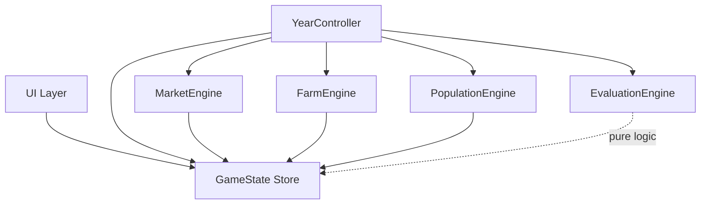
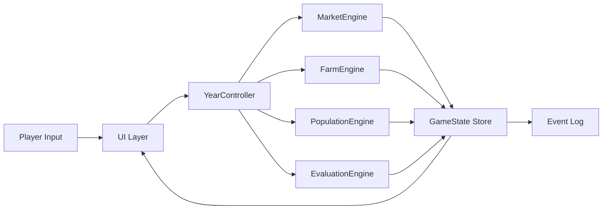

# Hammurabi TypeScript Port — Module Interface Specifications

## Overview
This document defines the public interfaces for each module in the Hammurabi TypeScript port. All modules use the `ReactiveTypescript` library for reactive state management.

## Shared Types

```typescript
/** Represents a single game event in the year-by-year log */
interface GameEvent {
    year: number;
    type: EventType;
    message: string;
    severity: 'info' | 'warning' | 'critical';
}

type EventType =
    | 'plague'
    | 'immigration'
    | 'harvest'
    | 'rats'
    | 'births'
    | 'starvation'
    | 'land_purchase'
    | 'land_sale'
    | 'feeding'
    | 'planting'
    | 'game_over';

/** Player decisions for a single year */
interface GameDecisions {
    acresToBuy: number;
    acresToSell: number;
    bushelsToFeed: number;
    acresToPlant: number;
}

/** Final evaluation rating */
enum GameRating {
    FANTASTIC = 'fantastic',
    GOOD = 'good',
    AVERAGE = 'average',
    POOR = 'poor',
    TERRIBLE = 'terrible',
    IMPEACHED = 'impeached',
}

/** Stats passed to the end-screen evaluation */
interface EvaluationStats {
    starvedAvg: number;
    starvedTotal: number;
    acresPerPersonStart: number;
    acresPerPersonEnd: number;
    yearsServed: number;
    finalPopulation: number;
}
```

## Module 1: GameState Store

**Technology:** `ReactiveStoreBase` from ReactiveTypescript

```typescript
interface GameState extends ReactiveStoreBase {
    // Core resources
    population: ReactiveValue<number>;
    acres: ReactiveValue<number>;
    grain: ReactiveValue<number>;
    year: ReactiveValue<number>;

    // Derived/computed values
    harvestYield: ReactiveValue<number>;
    landPrice: ReactiveValue<number>;
    acresPerPerson: ReactiveValue<number>;

    // Tracking
    starvedTotal: ReactiveValue<number>;
    starvedAvg: ReactiveValue<number>;
    fedThisYear: ReactiveValue<number>;
    immigrants: ReactiveValue<number>;
    starvedThisYear: ReactiveValue<number>;

    // Game state
    gameOver: ReactiveValue<boolean>;
    rating: ReactiveValue<GameRating | null>;
    events: ReactiveList<GameEvent>;

    // Methods
    reset(): void;
    advanceYear(): void;
    addEvent(event: GameEvent): void;
}
```

**Dependencies:** `ReactiveStoreBase`, `ReactiveValue`, `ReactiveList`

---

## Module 2: YearController

**Technology:** Plain TypeScript class, orchestrates other engines

```typescript
interface YearController {
    /** Initialize a fresh game */
    startNewGame(): void;

    /** Execute one full year cycle with player decisions */
    processYear(decisions: GameDecisions): Promise<void>;

    /** Evaluate the 10-year term */
    evaluateTerm(): void;

    /** Check if game has ended */
    isGameOver(): boolean;

    /** Subscribe to year-change events for UI updates */
    onYearChange(listener: (year: number) => void): Subscription;

    /** Subscribe to game-over events */
    onGameOver(listener: (rating: GameRating) => void): Subscription;
}
```

**Dependencies:** `GameState`, `MarketEngine`, `FarmEngine`, `PopulationEngine`, `EvaluationEngine`

---

## Module 3: MarketEngine

**Technology:** Plain TypeScript class (pure logic)

```typescript
interface MarketEngine {
    /** Generate random land price for the year (17-26 bushels/acre) */
    generateLandPrice(): number;

    /** Attempt to buy acres */
    buyAcres(
        acres: number,
        pricePerAcre: number,
        availableGrain: number
    ): TradeResult;

    /** Attempt to sell acres */
    sellAcres(
        acres: number,
        ownedAcres: number,
        pricePerAcre: number
    ): TradeResult;
}

interface TradeResult {
    success: boolean;
    message: string;
    acresTransferred: number;
    grainTransferred: number;
}
```

**Dependencies:** None (pure functions)

---

## Module 4: FarmEngine

**Technology:** Plain TypeScript class (pure logic)

```typescript
interface FarmEngine {
    /** Validate planting constraints */
    validatePlanting(
        acresToPlant: number,
        ownedAcres: number,
        availableGrain: number,
        population: number
    ): PlantingValidation;

    /** Calculate harvest yield (1-5 bushels/acre, random) */
    calculateHarvest(plantingAcres: number, yieldFactor: number): number;

    /** Calculate rat damage based on grain stores and random factor */
    calculateRatDamage(grainInStore: number, ratFactor: number): number;

    /** Deduct seed grain (half of planting acres) */
    deductSeed(availableGrain: number, plantingAcres: number): number;
}

interface PlantingValidation {
    valid: boolean;
    reason?: string;
    maxPlantable: number;
}
```

**Dependencies:** None (pure functions)

---

## Module 5: PopulationEngine

**Technology:** Plain TypeScript class (pure logic)

```typescript
interface PopulationEngine {
    /** Calculate how many people were fed (grain / 20 per person) */
    calculateFedPopulation(bushelsFed: number, population: number): number;

    /** Calculate births based on harvest, land, and grain */
    calculateBirths(
        harvestFactor: number,
        acresPerPerson: number,
        grainPerPerson: number,
        population: number
    ): number;

    /** Determine if plague strikes (15% chance, modified by grain factor) */
    checkPlague(grainFactor: number): boolean;

    /** Calculate number of people who starved */
    calculateStarvation(population: number, fed: number): number;

    /** Check if starvation exceeds impeachment threshold (45%) */
    validateStarvationThreshold(starved: number, population: number): boolean;
}
```

**Dependencies:** None (pure functions)

---

## Module 6: EvaluationEngine

**Technology:** Plain TypeScript class (pure logic)

```typescript
interface EvaluationEngine {
    /** Evaluate 10-year performance */
    evaluate(stats: EvaluationStats): GameRating;

    /** Get descriptive text for a rating */
    getRatingDescription(rating: GameRating): string;

    /** Get comparison historical figures for a rating */
    getHistoricalComparison(rating: GameRating): string;
}
```

**Dependencies:** None (pure functions)

---

## Module 7: UI Layer

**Technology:** Vanilla TypeScript + HTML + CSS

```typescript
interface GameUI {
    /** Render the main dashboard with current stats */
    renderDashboard(state: GameState): void;

    /** Render the decision panel with input fields */
    renderDecisionsPanel(decisions: GameDecisions): void;

    /** Append a new event to the log */
    appendEvent(event: GameEvent): void;

    /** Clear and render the full event log */
    renderEventLog(events: GameEvent[]): void;

    /** Render the end-screen evaluation */
    renderEndScreen(rating: GameRating, stats: EvaluationStats): void;

    /** Show validation error messages inline */
    showValidationErrors(errors: string[]): void;

    /** Clear validation errors */
    clearValidationErrors(): void;

    /** Wire up button click handlers */
    bindInputHandlers(onSubmit: (decisions: GameDecisions) => void): void;

    /** Subscribe to reactive state changes */
    subscribeToState(state: GameState): void;
}
```

**Dependencies:** `GameState`, `GameEvent`, `GameDecisions`, `GameRating`

---

## Module Dependency Graph



## Reactive State Flow


