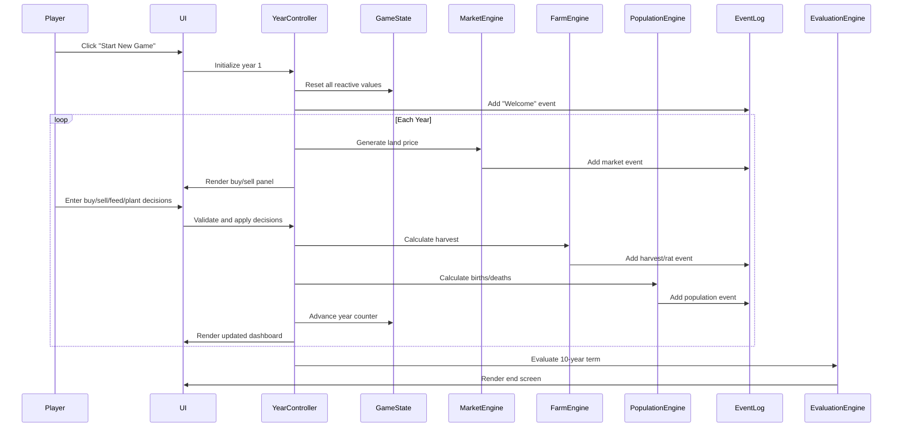

# Hammurabi — TypeScript/HTML Port: Technical Architecture

## Executive Summary
A modern browser-based reimagining of the classic Hammurabi resource-management simulation. Note: the original BASIC game file is titled "hmrabi.bas" (a common abbreviation), but the historical king's name is spelled **Hammurabi** with two m's. The player governs ancient Sumeria across a 10-year term, making decisions about land, grain, population, and infrastructure. The port leverages the existing **ReactiveTypescript** library for reactive state management, Vite for fast development, and modern CSS for a visually rich ancient Mesopotamian aesthetic.

## MVP Scope

### In Scope (MVP)
- Core year-loop: buy/sell land, feed people, plant crops, harvest, rat damage, births, plague
- Reactive state management via `ReactiveTypescript` library
- Single-page HTML application with Vite build tooling
- Ancient Sumerian-themed UI with cuneiform-inspired typography and clay-tablet aesthetic
- Year-by-year event log with visual notifications
- Final performance evaluation screen
- Responsive layout for desktop and tablet

### Out of Scope (Post-MVP)
- Trade routes and merchant system
- Building construction (granaries, temples, walls)
- Diplomacy with neighboring city-states
- Technology tree (irrigation, crop rotation)
- Population class system (farmers, merchants, priests)
- Tax system and military defense
- Interactive map or city visualization
- Sound design and music
- Mobile app packaging

## System Architecture

### Architecture Diagram

```mermaid
flowchart TD
    subgraph Client["Browser Client"]
        subgraph UI["UI Layer"]
            Dashboard["Dashboard Panel\n(Stats, Resources)"]
            Decisions["Decision Panel\n(Buy/Sell/Feed/Plant)"]
            EventLog["Event Log\n(Year-by-year narrative)"]
            EndScreen["End Screen\n(Performance evaluation)"]
        end

        subgraph State["Reactive State Layer"]
            GameState["GameState Store\n(ReactiveStoreBase)"]
            EventStore["EventStore\n(ReactiveList of events)"]
            ConfigStore["ConfigStore\n(Defaults, constants)"]
        end

        subgraph Logic["Game Logic Layer"]
            YearController["YearController\n(Orchestrates yearly cycle)"]
            MarketEngine["MarketEngine\n(Land pricing, buy/sell)"]
            FarmEngine["FarmEngine\n(Planting, harvest, rats)"]
            PopulationEngine["PopulationEngine\n(Births, deaths, plague)"]
            EvaluationEngine["EvaluationEngine\n(Final scoring)"]
        end

        subgraph Assets["Assets"]
            Styles["CSS / SCSS\n(Sumerian theme)"]
            Fonts["Cuneiform-inspired fonts"]
            Icons["SVG icons for events"]
        end
    end

    UI --> State
    State --> Logic
    Logic --> State
    Assets --> UI
```

### Data Flow

## Module Definitions

### Module 1: GameState Store
**Purpose:** Central reactive state container holding all game variables (population, acres, grain, year, etc.) using `ReactiveStoreBase`.

**Public Interface:**
- `population: ReactiveValue<number>` — current population
- `acres: ReactiveValue<number>` — owned land
- `grain: ReactiveValue<number>` — bushels in store
- `year: ReactiveValue<number>` — current year (1-10)
- `harvestYield: ReactiveValue<number>` — bushels per acre this year
- `landPrice: ReactiveValue<number>` — bushels per acre for trading
- `starvedTotal: ReactiveValue<number>` — cumulative deaths
- `starvedAvg: ReactiveValue<number>` — average starvation %
- `fedThisYear: ReactiveValue<number>` — people with full stomachs
- `immigrants: ReactiveValue<number>` — new arrivals this year
- `events: ReactiveList<GameEvent>` — event log entries

**Dependencies:** `ReactiveTypescript` library

### Module 2: YearController
**Purpose:** Orchestrates the yearly game cycle — the central loop that sequences market, decisions, harvest, population, and evaluation.

**Public Interface:**
- `startNewGame()`: Reset state and begin year 1
- `processYear(decisions: GameDecisions)`: Execute one full year cycle
- `evaluateTerm()`: Calculate final performance rating
- `isGameOver: ReactiveValue<boolean>` — game over flag

**Submodules:**
- `MarketEngine` — handles land pricing and trading logic
- `FarmEngine` — handles planting, harvest, and rat damage
- `PopulationEngine` — handles births, deaths, and plague
- `EvaluationEngine` — handles final scoring and rating

### Module 3: MarketEngine
**Purpose:** Generates annual land prices and processes buy/sell transactions.

**Public Interface:**
- `generateLandPrice(): number` — random price between 17-26 bushels/acre
- `buyAcres(acres: number, grain: number): { success: boolean, acres: number, grainSpent: number }`
- `sellAcres(acres: number, land: number): { success: boolean, acres: number, grainGained: number }`

**Dependencies:** `GameState` store

### Module 4: FarmEngine
**Purpose:** Calculates crop planting, harvest yield, and rat damage.

**Public Interface:**
- `validatePlanting(acresToPlant: number, ownedAcres: number, grain: number, population: number): { valid: boolean, reason?: string }`
- `calculateHarvest(plantingAcres: number, yieldFactor: number): number`
- `calculateRatDamage(grainInStore: number, ratFactor: number): number`
- `deductSeed(grain: number, plantingAcres: number): number`

**Dependencies:** `GameState` store

### Module 5: PopulationEngine
**Purpose:** Manages population dynamics — births, deaths, immigration, and plague.

**Public Interface:**
- `calculateFedPopulation(fedGrain: number, population: number): number`
- `calculateBirths(harvestFactor: number, acresPerPerson: number, grainPerPerson: number, population: number): number`
- `checkPlague(grainFactor: number): boolean`
- `calculateStarvation(population: number, fed: number): number`
- `validateStarvationThreshold(starved: number, population: number): boolean` — returns true if impeachment triggered

**Dependencies:** `GameState` store

### Module 6: EvaluationEngine
**Purpose:** Evaluates the player's 10-year performance and determines the outcome.

**Public Interface:**
- `evaluate(starvedAvg: number, acresPerPerson: number): GameRating`
- `getRatingDescription(rating: GameRating): string`

**GameRating enum:**
- `FANTASTIC` — avg starvation ≤ 3%, acres/person ≥ 10
- `GOOD` — avg starvation ≤ 10%, acres/person ≥ 9
- `POOR` — avg starvation ≤ 33%, acres/person ≥ 7
- `TERrible` — avg starvation > 33% or acres/person < 7
- `IMPEACHED` — starved > 45% in any single year

**Dependencies:** None (pure logic)

### Module 7: UI Layer
**Purpose:** Renders the game state and collects player input. Built with vanilla TypeScript + HTML + CSS (no framework needed for MVP).

**Public Interface:**
- `renderDashboard(state: GameState)`: Update stats panel
- `renderDecisionsPanel()`: Show buy/sell/feed/plant inputs
- `renderEventLog(events: GameEvent[])`: Append event entries
- `renderEndScreen(rating: GameRating, stats: EvaluationStats)`: Show final evaluation
- `bindInputHandlers(callbacks: GameCallbacks)`: Wire up button clicks

**Submodules:**
- `DashboardPanel` — displays population, acres, grain, year, land price
- `DecisionPanel` — form inputs for buy/sell/feed/plant with validation feedback
- `EventLogPanel` — scrollable narrative log with color-coded events
- `EndScreen` — performance rating with historical comparison

**Dependencies:** `GameState` store, CSS assets

## Technology Stack

| Component | Technology | Rationale |
|-----------|-----------|-----------|
| Build tool | Vite | Fast HMR, TypeScript support, simple config |
| Language | TypeScript 5 | Type safety, existing ReactiveTypescript integration |
| Reactive state | ReactiveTypescript | Already in project, reactive values/lists/dicts |
| UI | Vanilla TS + HTML + CSS | No framework overhead for MVP, full control |
| Styling | CSS custom properties + Flexbox/Grid | Modern CSS, easy theming |
| Fonts | Google Fonts (Noto Sans Cuneiform or similar) | Ancient aesthetic |
| Testing | Vitest | Fast, TypeScript-native, compatible with Vite |
| Linting | ESLint + Prettier | Code quality and consistency |

## Risks & Considerations
- **State reactivity complexity:** ReactiveTypescript's reactive values need careful subscription management to avoid stale UI renders.
- **Input validation UX:** The original BASIC game uses harsh line-number jumps for invalid input. The modern version should provide inline validation feedback instead.
- **Event log growth:** Over 10 years, the event log can grow large. Consider virtual scrolling or pagination for the log panel.
- **Accessibility:** Ensure color-coded events have text labels for screen readers.
- **Scope creep:** The expansion ideas (trade, buildings, diplomacy) are tempting but must be deferred to post-MVP to keep the project focused.
