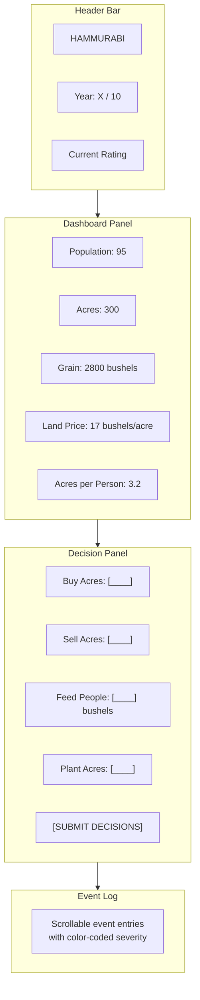

# Hammurabi TypeScript Port — UI/UX Design

## Design Philosophy
The UI reimagines the original BASIC text interface as a rich, immersive ancient Mesopotamian experience. The design draws inspiration from clay tablets, cuneiform inscriptions, and the visual language of ancient Sumer while maintaining modern usability standards.

## Visual Theme

### Color Palette
| Role | Color | Hex |
|------|-------|-----|
| Clay background | Warm sand | `#D4B896` |
| Tablet border | Dark terracotta | `#8B4513` |
| Text primary | Deep brown | `#3E2723` |
| Accent gold | Sumerian gold | `#C5A000` |
| Success green | Fertile land | `#2E7D32` |
| Warning amber | Drought | `#F57F17` |
| Danger red | Plague/starvation | `#C62828` |
| Water blue | Euphrates | `#1565C0` |

### Typography
- **Headings:** Google Font "Noto Sans Cuneiform" or "Cinzel" for cuneiform-inspired headers
- **Body text:** "Inter" or "Source Sans 3" for readability
- **Numbers/Monospace:** "JetBrains Mono" for resource values

### Visual Elements
- Clay tablet texture background with subtle noise
- Decorative borders inspired by Sumerian ziggurat patterns
- SVG icons for key events (wheat for harvest, skull for plague, baby for births, rats for rat damage)
- Animated transitions between years (fade + slide)

## Layout Structure

### Main Game Screen

### Dashboard Panel
- **Grid layout:** 2x3 card grid on desktop, stacked on mobile
- Each card shows a resource with icon, label, and value
- Values update reactively via `ReactiveValue` subscriptions
- Cards have subtle hover effects and border glow on change

### Decision Panel
- **Form layout** with labeled inputs and inline validation
- Each decision has a helper showing current constraints:
  - Buy: "Available grain: 2800 bushels"
  - Sell: "Owned acres: 300"
  - Feed: "Population: 95 (20 bushels per person)"
  - Plant: "Owned: 300 acres | Seed needed: 1 per 2 acres | Workers needed: 10 per acre"
- Submit button disabled until all inputs are valid
- Error messages appear inline below invalid fields

### Event Log
- **Scrollable panel** with auto-scroll on new events
- Each entry shows: year, event type icon, message, severity color
- Color coding:
  - Green: positive events (harvest, births, immigration)
  - Blue: neutral events (market prices, land transactions)
  - Orange: warnings (low grain, low population)
  - Red: critical events (plague, starvation, impeachment)
- Events are stored in `ReactiveList<GameEvent>` and rendered reactively

### End Screen
- Full-screen overlay with dramatic entrance animation
- Large rating display with historical comparison
- Summary statistics in a table format
- "Play Again" button to restart

## Responsive Design

| Breakpoint | Layout |
|------------|--------|
| ≥ 1024px | 4-column grid: Dashboard (top), Decisions (left), Event Log (right) |
| 768-1023px | 2-column grid: Dashboard (top), Decisions + Event Log (side by side) |
| < 768px | Single column: Dashboard → Decisions → Event Log (stacked) |

## Interaction Design

### Year Transition
1. Player submits decisions → button animates to "Processing..."
2. Year controller processes all engines sequentially
3. Each engine's results appear as animated event log entries
4. Dashboard cards pulse briefly when values change
5. Year counter increments with a flip animation

### Input Validation
- Real-time validation as user types (no wait for submit)
- Invalid inputs show red border + helper text
- Submit button stays disabled until all valid
- Original BASIC's harsh "THINK AGAIN" messages are replaced with friendly inline feedback

### Accessibility
- All color-coded events have text labels (e.g., "[CRITICAL] Plague struck!")
- Sufficient contrast ratios (WCAG AA compliant)
- Keyboard navigation: Tab through inputs, Enter to submit
- Screen reader announcements on state changes via ARIA live regions

## Creative Expansions (Post-MVP)

### Visual Enhancements
- **City visualization:** Small SVG cityscape that grows as the player builds granaries, temples, and walls
- **Seasonal background:** Background color shifts based on harvest quality (green for bounty, brown for drought)
- **Population avatars:** Small dot-grid showing population changes visually

### Gameplay Expansions
- **Trade routes:** Merchant caravans from neighboring cities offering grain at variable prices
- **Building system:** Construct granaries (increase storage), temples (boost morale/births), walls (defend against raids)
- **Diplomacy:** Relations with Elam, Akkad, and Ur — trade agreements, alliances, conflicts
- **Technology tree:** Unlock irrigation (+20% harvest), crop rotation (+15% harvest), written law (+10% immigration)
- **Population classes:** Farmers, merchants, priests — each with different needs and contributions
- **Tax system:** Set tax rates affecting population growth vs. grain collection
- **Random events:** River flooding (+harvest), drought (-harvest), refugee waves (+population)

### Post-MVP UI Features
- **Dark mode:** Night-time Sumerian theme with torch-lit aesthetic
- **Sound effects:** Subtle ambient sounds (market bustle, river flow, temple bells)
- **Achievement system:** Unlock badges for milestones (first 1000 bushels harvest, survive plague, etc.)
- **Multiplayer:** Competitive governor rankings based on performance ratings
